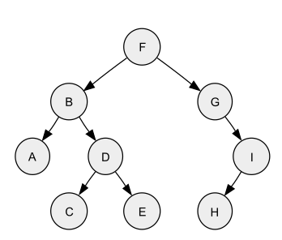

### Need a Spare Postgres? Here.

```
docker run --name school-postgres -e POSTGRES_PASSWORD=mysecretpassword -p 5432:5432 -d postgres
```

---

# Modified Preorder Trees

As a concept, the modified pre-order tree isn't any more than a... Modified Pre-Order Depth-First Search implementation. The shape of tree is what many developers think when they think "tree traversal". The tree doesn't balance, distribute data any specific way, it's just a tree. 

So many modern concepts are designed as trees, especially replies and comment sections. Think about it, a parent (post) has multiple children (comments) that in return have their own children (comments) that... you get the point.

## Pre-Order Searching

To understand a modified pre-order search, we need to understand a "traditional" pre-order search. [Brilliant.org](https://brilliant.org/wiki/traversals/) defines pre-order searching as "visiting the current node, and successively moving to the left until a leaf is reached, visiting each node on the way there. Once there are no more children on the left of a node, the children on the right are visited." 

Let's take a visual look at what that *actually* means. 


*Credit: Wikimedia*

For this tree, we would visit the nodes in the following order:

- F, B, A, D, C, E, G, I, H

However, if we think of each node as a comment to a post (`F`) we could optimize the loading of our comments, and, with a little bit of *modified* logic, visit our nodes based on something like likes, or a timestamp, who posted it, or some weird heuristic of all three. 

## Modified Pre-Order Searching

For simplicities sake, let's assume we only want to consider a timestamp as our "deciding factor", we could choose to visit the nodes like this:

- F, B, G, A, D, C, E, I, H

Loading the oldest data/comments last keeps relevant conversation shown to the user first and can allow us to simulate faster page loads by deferring the older comments (`I`, `H`) to only load when they're scrolled into view (or, take a page from Reddit and have the user select "Show More Comments"). Loading this data without a Modified Pre-Order search without consideration to how it'll actually be displayed, or loading too much data (and recuring into comments the user will never read or see) results in higher database load on the server and sending a potentially large payload to a client with a slower internet connection may run the risk of effectively doxing them by spending their bandwidth.

## Building It

Jumping right into it, let's talk tech. 

This demo is a TypeScript app